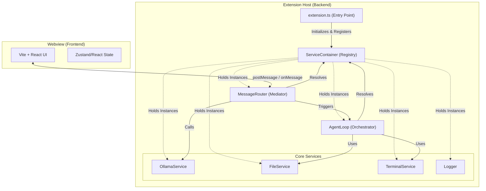
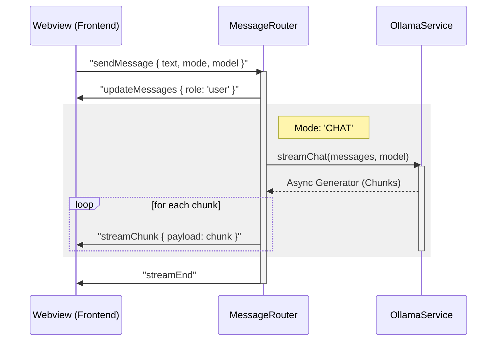
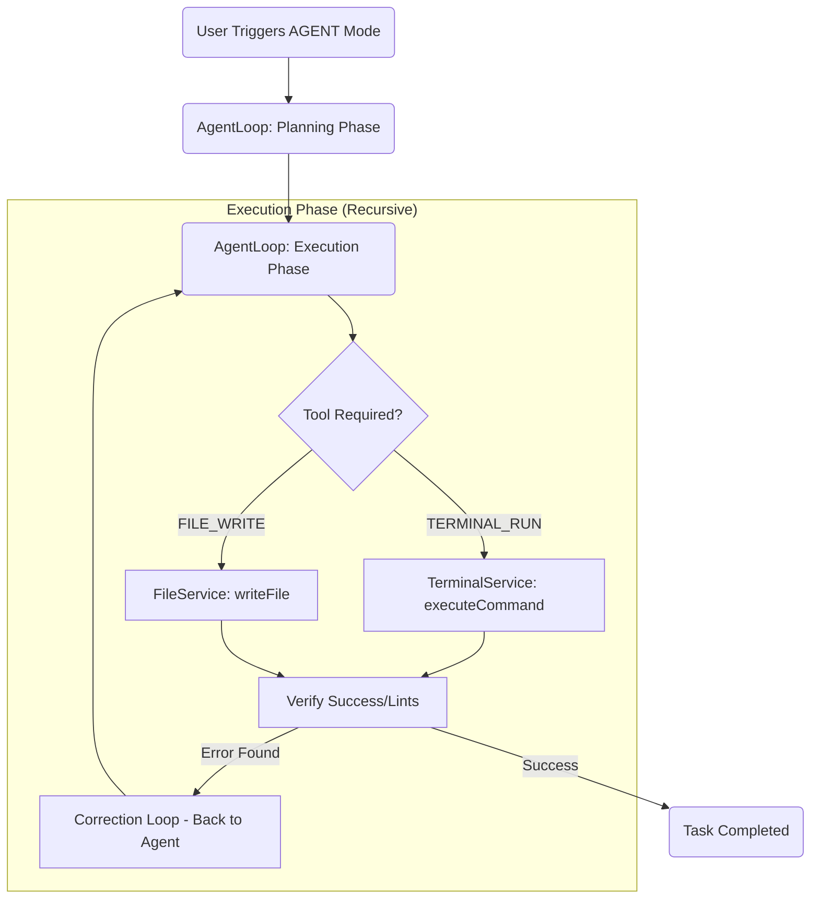

# Lokal Coder Agent Architecture

This document provides a technical deep-dive into the architectural patterns, component relationships, and data flows within the Lokal Coder Agent extension for VS Code.

---

## 🏗️ 1. Core Architectural Pillars

The system is built on three foundational design patterns to ensure scalability, testability, and a clear separation of concerns.

### 1.1 Service-Oriented Architecture (SOA)

The extension host logic is decomposed into discrete, specialized Services. Each service handles a specific VS Code API or external integration (e.g., FileSystem, Terminal, Ollama). Services communicate via well-defined interfaces and are never tightly coupled.

### 1.2 Dependency Injection (DI)

All services are managed by a central `ServiceContainer` (Service Locator).

- **Singleton Lifecycle**: Services are instantiated once during extension activation.
- **Mockability**: By resolving services through the container, we can easily swap them for mocks during unit testing.

### 1.3 Mediator Pattern (Message Routing)

To prevent the Webview (Frontend) and the Extension Host (Backend) from having direct knowledge of each other's internals, a `MessageRouter` acts as a mediator.

- **Command Dispatch**: The router receives serializable JSON payloads from the webview and dispatches them to the appropriate services.
- **Asymmetric Communication**: Communication is purely over `postMessage` (Frontend -> Backend) and `webview.postMessage` (Backend -> Frontend).

---

## 🧩 2. Component Architecture

The following diagram visualizes how the core components are registered and interact within the system.

---

## 🔄 3. Data Flow: Message Lifecycle

Tracing a standard user prompt through the system provides clarity on the mediator's role and the asynchronous nature of the LLM integration.

### 3.1 Prompt Submission (Sequence)

---

## 🤖 4. Agentic Execution Flow

When operating in `AGENT` mode, the system enters a high-autonomy loop managed by the `AgentLoop`.

---

## 🛠️ 5. Service Definitions & APIs

### 5.1 ServiceContainer

The central registry for all extension services.

- `register(key, instance)`: Saves a service instance.
- `resolve(key)`: Returns a strictly-typed service instance.

### 5.2 MessageRouter

The bridge between VS Code and the React UI.

- `handle(message, webview)`: The entry point for all incoming webview messages. Dispatches to private handlers (e.g., `handleSendMessage`, `handleListModels`).

### 5.3 OllamaService

Encapsulates all LLM interaction.

- `listModels()`: Fetches available tags from the local Ollama instance.
- `streamChat(messages, model, signal)`: Handles OpenAI-compatible streaming over a local network.

### 5.4 TerminalService

Securely handles command execution.

- `executeCommand(command)`: Proxies directly to the VS Code Terminal API.
- `getOrCreateTerminal()`: Ensures a stable "Lokal Coder" terminal instance exists.

### 5.5 FileService

Abstractions for workspace manipulation.

- `writeFile(path, content)`: Uses `vscode.workspace.fs` for atomic writes.
- `readFile(path)`: Reads workspace files as UTF-8 strings.

---

> [!NOTE]
> This documentation is a living technical specification. Adherence to these patterns ensures that Lokal Coder remains "agent-readable" for future autonomous maintenance.
