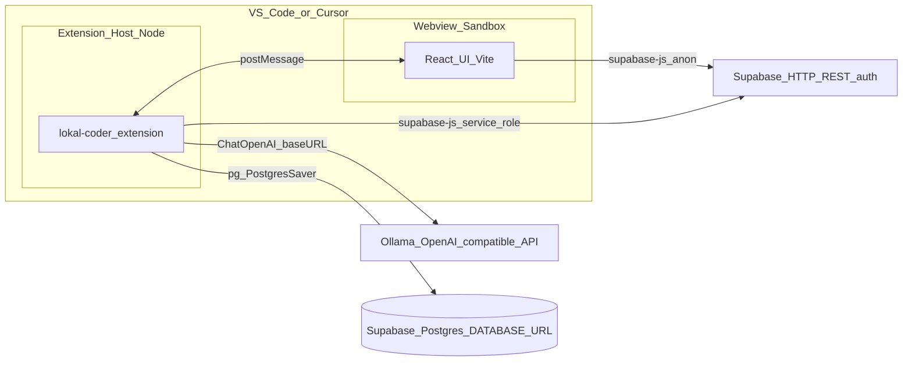
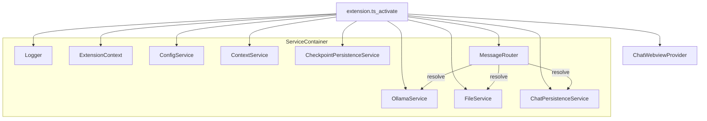
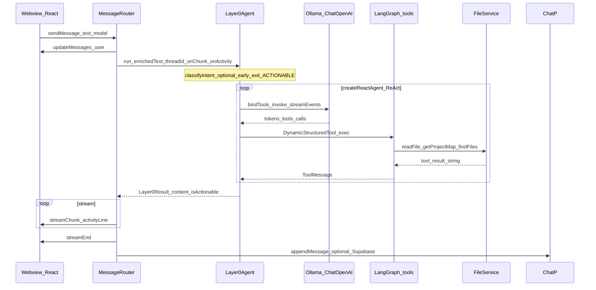
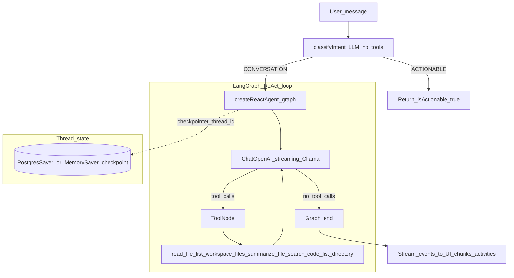
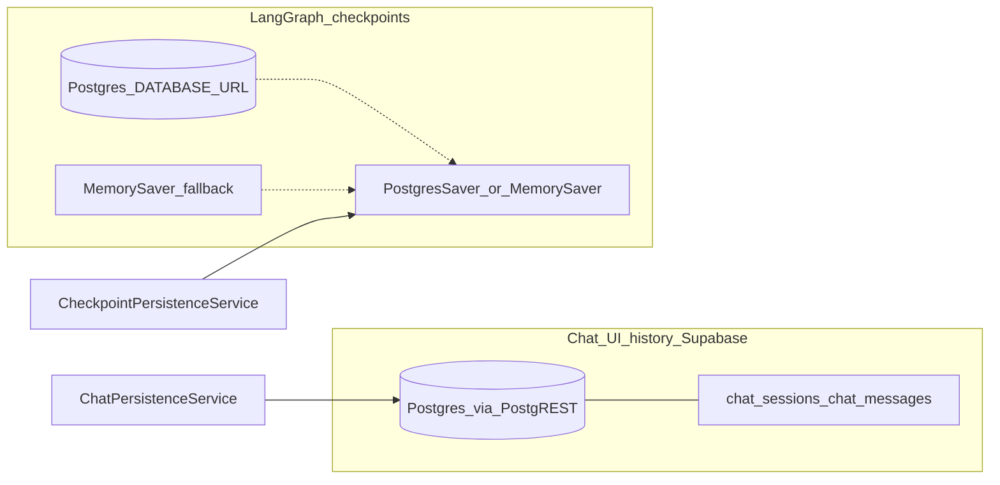

# Lokal Coder — High-Level Architecture (HLD)

Use this document when reasoning about **how the extension is structured**, **where logic lives**, and **how data moves**. Diagrams are [Mermaid](https://mermaid.js.org/); keep mental model aligned with the **TypeScript** extension host + **React** webview (not Python).

---

## 1. System context

---

## 2. Runtime components (service locator)

---

## 3. Chat turn: webview to Layer 0 (Fast Plan path)

---

## 4. Layer 0 internal flow

---

## 5. Persistence split

---

## 6. Key file map (anchor for “where is X?”)

| Concern                           | Primary location                                                                |
| --------------------------------- | ------------------------------------------------------------------------------- |
| Activation & DI wiring            | `src/extension.ts`                                                              |
| Webview ↔ host bridge             | `src/services/chat/messageRouter.ts`, `src/services/webview/webviewProvider.ts` |
| Layer 0 agent (intent + ReAct)    | `src/services/agentic/layer0Agent.ts`                                           |
| Workspace tools                   | `src/services/agentic/tools/agentTools.ts`, `searchTools.ts`                    |
| Ollama / OpenAI-compatible client | `src/services/llms/ollamaService.ts`, `ChatOpenAI` in Layer0                    |
| Supabase chat CRUD                | `src/services/chat/chatPersistenceService.ts`                                   |
| LangGraph checkpointer            | `src/services/persistence/checkpointPersistence.ts`                             |
| Settings & `.env` overlay         | `src/services/config/configService.ts`                                          |
| Web UI state & streaming          | `webview/src/contexts/SessionContext.tsx`, `webview/src/App.tsx`                |

---

_This HLD reflects the extension as a **TypeScript** VS Code project. Layer 1+ planner/executor flows may extend this diagram when implemented._
